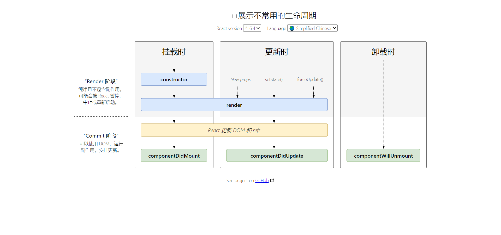

## React 和 ReactDom

React 负责逻辑控制，数据 -> VDOM
ReactDom 渲染实际 DOM， VDOM -> DOM
React 使⽤ JSX 来描述 UI
⼊⼝⽂件定义，在 webpack 配置文件如 webpack.config.js 的 entry 属性里

#### 为什么组件里没有使用 React 对象，但需要引入 React

webpack 会把 jsx 语法经过 babel 转译成 React.createElement，所以当使用 jsx 时识别到的标签都会转译。

如:

```js
import React from "react";
import ReactDOM from "react-dom";

// 这⾥怎么没有出现React字眼?
ReactDOM.render(<h1>Hello React</h1>, document.querySelector("#root"));

// 其实经过webpack后

ReactDOM.render(React.createElement(
  "h1",
  {},
  "Hello React", document.querySelector("#root"));

// __source,__self 属性是开发环境时调式使用的，在生成环境时不会存在。
```

JSX => React.createElement(...)

## JSX

JSX 是⼀种 JavaScript 的语法扩展，其格式⽐较像模版语⾔，但事实上完全是在 JavaScript 内部实现的。

JSX 实质就是 React.createElement 的调⽤，最终的结果是 React“元素”（JavaScript 对象）。

```js
const jsx = <h2>react study</h2>;
ReactDOM.render(jsx, document.getElementById("root"));
```

#### 使⽤ JSX

在 jsx 里使用表达式`{}`

1. 变量

```js
const name = "react study";
const jsx = <h2>{name}</h2>;
```

2. 函数

```js
const dicts = [{ key: "id01", name: "React" }];

function transName(key) {
  const dict = dicts.find((item) => item.key === key) || {};
  return dict.name;
}

const jsx = <h2>{transName("id01")}</h2>;
```

3. jsx 也是 js 对象

```js
const com = <div>test</div>;
const jsx = <div>{com}</div>;
```

4. 条件语句

```js
const name = "123";
const jsx = (
  <div>
    {/* 条件语句 */}
    {name ? <h2>{name}</h2> : null}
  </div>
);
```

5. 数组

数组会被作为⼀组⼦元素对待，数组中存放⼀组 jsx 可⽤于显示列表数据，每一项都必须有 key 值并且不能相等，尽量不要使用 index 索引

```js
const jsx = (
  <div>
    {/* 数组 */}
    <ul>
      {[1, 2, 3, 4].map((item) => (
        <li key={item}>{item}xxx</li>
      ))}
    </ul>
  </div>
);
```

6. 属性

属性：一般都是花括号，但有些需要使用双花括号如 style； class、 for 等要特殊处理。

```js
import logo from "./logo.svg";
const jsx = (
  <div>
    
  </div>
);
```

## 组件

组件是抽象的独⽴功能模块， react 应⽤程序由组件构建⽽成。

组件化优点：

1. 增强代码重⽤性，提⾼开发效率
2. 简化调试步骤，提升整个项⽬的可维护性
3. 便于协同开发

### 组件的两种形式

组件有两种形式： function 组件和 class 组件。

#### class 组件

class 组件通常拥有状态和⽣命周期， 继承于 Component， 实现 render ⽅法

class 组件使⽤ state 和 setState 维护状态

```js
import React, { Component } from "react";

export default class Test extends Component {
  state = { num: 0 };
  handleClick = () => {
    const { num } = this.state;

    this.setState({ num: num + 1 });
  };
  render() {
    const { num } = this.state;

    return (
      <div>
        <p>{num}</p>
        <button onClick={this.handleClick}>按钮</button>
      </div>
    );
  }
}
```

setState 特性

- ⽤ setState 更新状态⽽不能直接修改

```js
this.state.num += 1; //错误的
```

- setState 是批量执⾏的，因此对同⼀个状态执⾏多次只起⼀次作⽤，多个状态更新可以放在同⼀个 setState 中进⾏。

```js
componentDidMount() {
// 假如num初始值为0，执⾏三次以后其结果是多少？
this.setState({counter: this.state.num + 1});
this.setState({counter: this.state.num + 1});
this.setState({counter: this.state.num + 1});
}
```

- setState 通常在执行效果上是异步的，因此如果要获取到最新状态值有以下四种⽅式：

1. 传递函数给 setState ⽅法，并更新 state

```js
// num 0
this.setState((nextState, props) => ({
  counter: nextState.num + 1,
})); // 1
this.setState((nextState, props) => ({
  counter: nextState.num + 1,
})); // 2
this.setState((nextState, props) => ({
  counter: nextState.num + 1,
})); // 3
```

2. 传递函数给 setState 第二参数

```js
// num 0
this.setState(
  {
    counter: this.state.num + 1,
  },
  () => {
    console.log(this.state.num);
  }
); // 1
```

3. 异步方法如定时器

```js
setTimeout(() => {
  // num 0
  this.setState({
    counter: this.state.num + 1,
  });
  console.log(this.state.num); // 1
}, 0);
```

4. 原⽣事件中修改状态

```js

componentDidMount() {
    document.body.addEventListener("click", this.changeValue, false);
}
changeValue = () => {
    this.setState({ counter: this.state.num + 1 });
    console.log(this.state.num); // 1
};

```

setState 只有在合成事件和钩⼦函数中是异步的，在原⽣事件和 setTimeout、 setInterval 等异步方法 中都是同步的。

#### 函数组件

函数组件返回渲染结果，React16.8 以上后也是有状态的组件，既 React hooks。

```js
function App() {
  return <div>函数组件</div>;
}
```

不进行详细描述，可到 React 官网上学习，略。

## 事件处理

React 中使⽤ onXX 写法来监听事件，如 onClick。

```
import React, { Component } from "react";
export default class Search extends Component {
  constructor(props) {
    super(props);
    this.state = { name: "" };
    // this.change = this.change.bind(this);
  }
  btn = () => {
    //使⽤箭头函数，不需要指定回调函数this，且便于传递参数
    console.log("btn");
  };
  change = (e) => {
    let value = e.target.value;
    this.setState({
      name: value,
    });
    console.log("name", this.state.name);
  };
  render() {
    const { name } = this.state;
    return (
      <div>
        <button onClick={this.btn}>按钮</button>
        <input
          type="text"
          placeholder="请输⼊"
          name={name}
          onChange={this.change}
        />
      </div>
    );
  }
}

```

事件回调函数注意绑定 this 指向，常⻅三种⽅法：

1. 构造函数中绑定并覆盖： this.change = this.change.bind(this)
2. ⽅法定义为箭头函数： change = ()=>{}
3. 事件中定义为箭头函数： onChange={()=>this.change()}

react ⾥遵循单向数据流，没有双向绑定，输⼊框要设置 value 和 onChange，称为受控组件

## 组件通信

#### Props 属性传递

Props 属性传递可⽤于⽗⼦组件相互通信

父传子直接使用 props

子传父，props 传递一个方法，让子调用，把参数传递到父上

#### context

跨层级组件之间通信

React 中使⽤ Context 实现祖代组件向后代组件跨层级传值。

在 Context 模式下有两个⻆⾊：

- Provider：外层提供数据的组件
- Consumer ：内层获取数据的组件

##### 使⽤ Context

创建 Context => 获取 Provider 和 Consumer => Provider 提供值 => Consumer 消费值

模拟 redux 存放全局状态，在组件间共享

例子在`src\pages\context-test`

在 React 的官⽅⽂档中， Context 被归类为⾼级部分(Advanced)，属于 React 的⾼级 API，但官⽅并不建议在稳定版的 App 中使⽤ Context

但我们可以了解它，知道 React-Redux 怎么实现跨组件通信

#### Redux

略

## ⽣命周期

[React 官网-⽣命周期](https://zh-hans.reactjs.org/docs/react-component.html)

[生命周期图谱](https://projects.wojtekmaj.pl/react-lifecycle-methods-diagram/)



V17 可能会废弃的三个⽣命周期函数⽤ getDerivedStateFromProps 替代，⽬前使⽤的话加上 UNSAFE：

- componentWillMount
- componentWillReceiveProps
- componentWillUpdate

引⼊两个新的⽣命周期函数:

- static getDerivedStateFromProps
- getSnapshotBeforeUpdate

#### 废弃原因

原来（React v16.0 前）的⽣命周期在 React v16 推出的 Fiber 之后就不合适了，因为如果要开启 async rendering，在 render 函数之前的所有函数，都有可能被执⾏多次。

原来（React v16.0 前）的⽣命周期有哪些是在 render 前执⾏的呢？

- componentWillMount
- componentWillReceiveProps
- shouldComponentUpdate
- componentWillUpdate

如果开发者开了 async rendering，⽽且⼜在以上这些 render 前执⾏的⽣命周期⽅法做 AJAX 请求的话，那 AJAX 将有可能会被多次调⽤，明显不是我们期望的结果。⽽且在 componentWillMount ⾥发起 AJAX，不管多快得到结果也赶不上⾸次 render，这样的请求操作放在 componentDidMount ⾥更合适。

所以我们避免使用除了 shouldComponentUpdate 的其他几个生命周期，而它们有代替 API，getDerivedStateFromProps。

也就是⽤⼀个静态函数 getDerivedStateFromProps 来取代被 遗弃 的⼏个⽣命周期函数，就是强制开发者在 render 之前只做⽆副作⽤的操作，⽽且能做的操作局限在根据 props 和 state 决定新的 state
